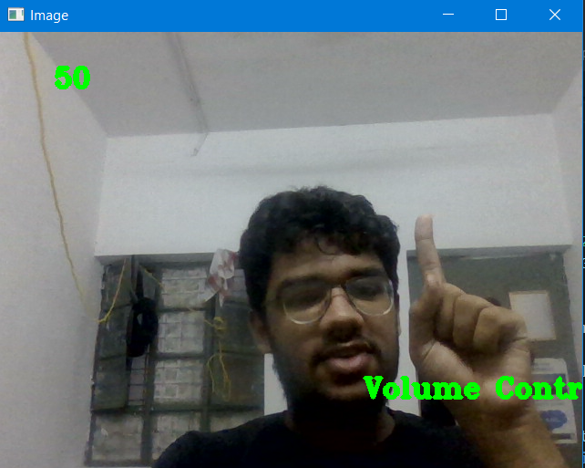

# Contactless Laptop
## Project Description 
This is an introductory idea (or more of a concept) on how can a contactless laptop may work. For starters I have included just 3 things. Volume control, Show desktop and mouse control. It has the following dependencies. 
- opencv-python (For computer Vision)
- mediapipe (For hand recognition)
- Math (for distance and ratios)
- time (for pausing for a moment (will be relevant later))
- pyautogui (For windows control)
- ctypes, pycaw, comtypes (for volume control)
- numba (for running mouse control on GPU) [Not working currently]
## Installation
Download the relevan pre-requisite and clone the repository. Upon that run choose.py
## Usage 
Initially show your hands in raised manner to the camera. It will run a callibration of your handsize and then comes a message "it's now ready to use".

Then there are mutliple options to choose from 
Left hand is your chooser and right hand is your main usage hand. 
1st finger: Volume Control 
2 fingers: Show desktop 
3 fingers: Mouse control 
### Volume Control
Show your first finger to choose Volume control

Then use right hand to set your volume and when you have chosen the right volume (upper left corner)
and then once you have decided, show both hands to set it and remove your right hand. Now the volume is fixed at that level. 

### Show Desktop
Just show two fingers and remove them and you will be able to see your desktop. Show it again to open back all the windows 
### Mouse Control 
Show 3 fingers to enable mouse control. Then use your life hand to move the cursor.

Show both hands to drag the mouse in a particular direction as if holding down the left mouse button (Essentially for MS Paint) 
## Future Prospects 
Moving the entire platform to GPU (didn't get time to work on this in detail so wasn't able to enable it at the moment). Exploring other ways to create gestures and identificaiton. 
Learning voice activation modules of python to transition from contactless to handless laptop usage. 
